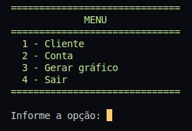
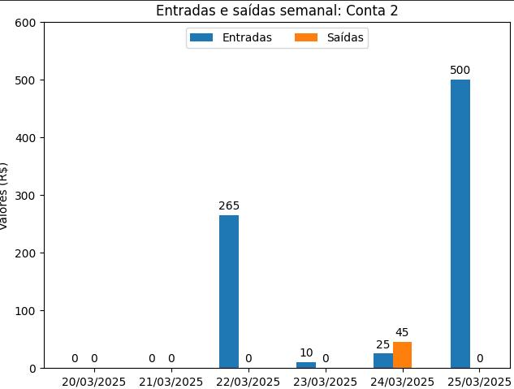
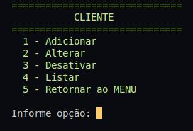
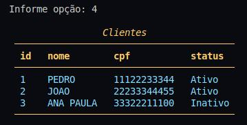
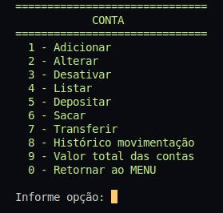
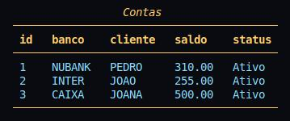
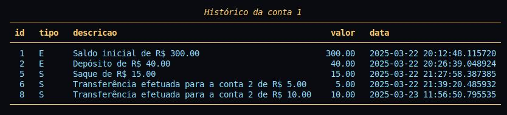

# Gestão de Contas

> Projeto desenvolvido na [4d4p_Ed2](https://pythonando.com.br "Pythonando"), mas com modificações.

## Objetivo

    Gerenciar clientes e contas, como também registrar todo o histórico de movimentações.

## Sumário

- <a href='#pré-requesitos'>Pré-requisitos</a>
- <a href='#funcionalidades'>Funcionalidades</a>
- <a href='#screenshots'>Screenshots</a>
- <a href='#como-executar-o-projeto'>Como executar o projeto</a>

### Pré-requisitos

    Bibliotecas: sqlmodel, matplotlib e rich.

### Funcionalidades

- Cadastro de clientes e contas
- Alterar clientes e contas
- Listagem dos clientes e contas
- Desabilitar os clientes e contas
- Consultar o saldo total de todas as contas
- Gráfico da movimentação diária durante 7 dias.

### Screenshots

<table>
    <tr>
        <td></td>
        <td></td>
    </tr>
    <tr>
        <td></td>
        <td></td>
    </tr>
    <tr>
        <td></td>
        <td></td>
    </tr>
    <tr>
        <td colspan="2"></td>
    </tr>
</table>

### Como executar o projeto

```bash
# Clone o projeto
git clone https://github.com/gm-costa/gestao_contas.git

# A partir daqui vou usar o comando 'python3', pois uso linux, quem for 
# usar no windows, pode substituir por 'python' ou somente 'py'

# Crie o ambiente virtual
python3 -m venv venv

# Ative o ambiente
    # No Linux
        source venv/bin/activate
    # No Windows
        venv\Scripts\Activate

# Instale as bibliotecas
pip install -r requirements.txt

# Teste o projeto, em um browser digite
python templates.py

```

---
